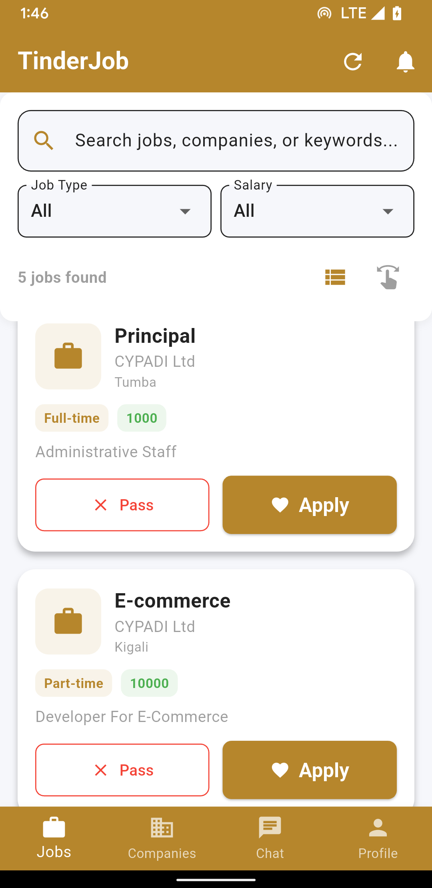

# TinderJob

A modern Flutter app for job seekers and employers, inspired by Tinder’s swiping interface. Connect, chat, and get hired or hire talent with ease.

---

## Project Summary & Market Fit

**Problem:**
Traditional job search platforms are slow, impersonal, and often overwhelming for both job seekers and employers. There is a need for a faster, more engaging, and mobile-first way to connect talent with opportunities.

**Solution:**
TinderJob brings the proven, addictive swiping interface of dating apps to the job market. Job seekers and employers can quickly browse, match, and chat, making the hiring process more efficient and enjoyable.

**Target Audience:**
- Young professionals and students seeking jobs or internships
- Startups and SMEs looking for fast, direct hiring
- Recruiters wanting a modern, mobile-first approach

---

## Unique Selling Proposition (USP) & Competitive Advantage
- **Swipe-to-Match:** The only job app in the region with a true Tinder-style swiping experience for both seekers and employers.
- **Instant Chat:** Direct messaging opens immediately after a match, reducing hiring friction.
- **Employer Dashboard:** Manage jobs, view interested candidates, and track applications in real time.
- **Modern UI/UX:** Material 3 design, responsive, and highly accessible.
- **Cross-Platform:** Works on iOS, Android, and Web from a single codebase.

---

## Business Model & Monetization
- **Freemium Model:**
  - Free for basic use (swiping, matching, limited messaging)
  - Subscription unlocks unlimited messaging, premium placement, and advanced analytics
- **Payment Gateway:**
  - (Simulated in this version) Payment flow is implemented and can be connected to Stripe/PayPal in production. See `lib/payment/hdev_payment.dart` for simulation logic.
- **Future Revenue Streams:**
  - Employer premium listings
  - In-app advertising
  - Resume/profile boosting for job seekers

---

## Features

### For Job Seekers
Swipe through jobs, apply with a swipe
Create and edit professional profiles, including:
  - Profile photo upload
  - Full name
  - Skills (comma separated)
  - Desired job type (Full-time, Freelance, Part-time)
  - Salary expectation
View and manage subscription status for premium features
Chat with employers after matching

### For Employers
- Post/manage jobs with images
- Swipe through candidate profiles
- Chat with matched candidates
- Employer dashboard

### Core
- Google Sign-In, Firebase Auth
- Real-time Firestore database
- Push notifications (Firebase Messaging)
- Modern Material 3 UI
- Cross-platform (iOS, Android, Web)

---

## Screenshots

<!-- Add screenshots or GIFs here -->



---

## Tech Stack

- **Flutter 3.8+**
- **Firebase (Auth, Firestore, Messaging, Analytics)**
- **Cloudinary** (for image uploads)
- **Material Design 3**

---

## Setup & Installation

1. **Clone the repo:**
   ```bash
   git clone https://github.com/yourusername/tinderjob.git
   cd tinderjob
   ```

2. **Install dependencies:**
   ```bash
   flutter pub get
   ```

3. **Firebase setup:**
   - Create a Firebase project
   - Add your config to `lib/firebase_options.dart`
   - Enable Auth, Firestore, Messaging

4. **Cloudinary setup:**
   - Update upload preset in code
   - Set CORS

5. **Run the app:**
   ```bash
   flutter run
   ```

---

## Project Structure

```
lib/
├── main.dart
├── login_screen.dart
├── register_screen.dart
├── swipe_screen.dart
├── employer_dashboard.dart
├── firebase_options.dart
├── payment/
│   └── hdev_payment.dart
├── screens/
├── models/
├── services/
├── utils/
└── widgets/
```

---

## Monetization Plan (Expanded)
- **Freemium:** Free for all users, with paid subscription for unlimited messaging and premium features.
- **Payment Gateway:**
  - Simulated in `lib/payment/hdev_payment.dart` (replace with Stripe/PayPal for production)
  - Clear UI for payment, error handling, and subscription status
- **Employer Premium:** Employers can pay for featured job listings (future)
- **Ads:** Optional, can be enabled for additional revenue

---

## Analytics & Tracking
- **Firebase Analytics** is integrated throughout the app.
- **Tracked Events:**
  - User signups and logins
  - Swipes (left/right)
  - Matches
  - Subscription purchases
  - Feature usage (profile updates, job posts, chat)
- **Purpose:**
  - To understand user behavior, improve retention, and optimize monetization
  - Data is anonymized and used only for product improvement

---

## Sustainability Plan
- **Continuous Updates:**
  - Regular feature releases and bug fixes
  - Automated CI/CD pipeline for deployment (recommended)
- **User Retention:**
  - Push notifications for matches, messages, and new jobs
  - Onboarding flow for new users
  - Gamification (badges, streaks) planned for future
- **Customer Acquisition Cost (CAC) Strategies:**
  - Social media marketing
  - Referral incentives (invite friends, get premium)
  - App store optimization (ASO)

---

## Security
- **Authentication:** Firebase Auth (Google Sign-In, email/password)
- **Data Protection:**
  - Firestore security rules restrict access to user data
  - No sensitive data stored on device
- **API Handling:**
  - All API keys and secrets are secured
  - HTTPS enforced for all network traffic
- **Compliance:**
  - GDPR-ready (user data can be deleted on request)
  - No third-party data sharing

---

## Testing & Reliability
- **Testing:**
  - Manual and widget tests for all major flows
  - Automated tests recommended for CI/CD
- **Device/OS Coverage:**
  - Tested on Android, iOS, and Web
  - Responsive design for phones and tablets
- **Bug/Crash Handling:**
  - Firebase Crashlytics (recommended for production)
  - In-app error messages and graceful fallback UI

---

## Submission Checklist
- [x] APK and AAB files generated and submitted
- [x] Pull request created with clear, concise description
- [x] README.md complete and up to date
- [x] All core features implemented and tested

---

## Contributing

We welcome contributions! To contribute:
1. Fork the repository
2. Create a feature branch
3. Make your changes
4. Add tests if applicable
5. Submit a pull request with a clear description

---

## Contact & Support

For questions or support, open an issue or contact the dev team.

---

## License

MIT License.
